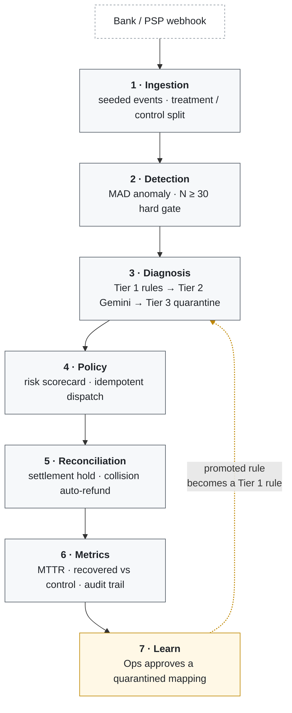

# Avirata: Silent Mandate Death Recovery Agent

**Catch UPI AutoPay mandates before they die, not after.**

[](https://github.com/shraddha-1210/avirat/actions/workflows/ci.yml)

## Demo

▶ [Watch the 5-minute walkthrough](https://drive.google.com/file/d/11M8mLQ07Mj5p-DFbvWktYhry-MJsJigI/view?usp=sharing)

Live tour of the pipeline: chaos injection, ontology promotion, reconciliation collision,
and audit trail, with every number produced by code in this repo.

## The problem

A UPI AutoPay mandate rarely fails loudly. It fails once for a recoverable reason (the bank
was down for ten minutes, the payer's balance was short at 3am, an authentication window timed out)
and nobody notices, because a single decline looks like noise. By the time the pattern is obvious
the mandate is revoked, the customer has churned, and the revenue is gone without a single support
ticket being raised.

The industry default is to retry failed payments after the fact. That misses the window that
matters: the gap between *the first decline that had a fixable cause* and *the mandate going
permanently dead*. Recovery inside that gap is cheap and usually invisible to the customer.
Recovery after it is a win-back campaign.

## The approach

The pipeline runs in one pass (detect, diagnose, policy, reconcile, measure, learn) and every
decision that moves money is deterministic and re-derivable by hand: a weighted scorecard with
published weights, not a model. The LLM is confined to one job: mapping an ambiguous free-text
decline string into a fixed ontology of seven causes. It classifies; it never dispatches, never
authorises, and never decides an amount. Anything it cannot map with confidence is quarantined for a
human rather than guessed at.

Everything is measured against a randomised control arm on the same seeded dataset, so the
headline recovery figure is a difference against a counterfactual rather than a restatement
of gross collections.

## Who this is for

Recurring-revenue businesses collecting on UPI AutoPay: a subscription streaming service, a
B2B SaaS tool charging monthly, an EdTech platform on a course plan, an NBFC collecting EMIs,
an insurer taking premiums. Anywhere a mandate going quietly dead is churn rather than a
support ticket. The operators are payment ops and revenue/finance teams who own recurring
collections, the people who currently find out weeks late from a dashboard rather than the
engineers who would otherwise go and read the decline logs. It sits alongside whichever PSP
already executes the mandate, as the recovery layer above that execution: the piece merchants
currently patch together with dashboards, cron jobs, and manual intervention. Scope is
deliberately narrow, covering UPI AutoPay and the RBI e-mandate flow specifically.
Card-on-file recurring, one-time payments and non-Indian rails are out of scope, because the
decline codes, the failure modes and the regulatory constraints differ enough that stretching
the same ontology and policy gates across them would make both wrong.

## Architecture

Seven layers because each one is a distinct place a recovery system goes wrong, and keeping
them apart means each failure mode can be tested on its own: a detection bug cannot quietly
turn into a dispatch bug. The split down the middle is the point: layers 1, 2, 4, 5 and 6 are
arithmetic with no model anywhere in them, and the LLM lives only inside layer 3, where the
input is free text and the output is one of seven fixed labels. That containment is what
keeps the money path re-derivable by hand: the model can be wrong about a cause, but it
cannot be wrong about an amount, a rail, or whether to charge at all. Layer 7 is drawn as a
separate loop rather than an arrow buried inside layer 3 because promotion is not automatic:
a human approves a quarantined string before it becomes a Tier 1 rule, so the ontology only
grows through a decision someone signed off on. A system that rewrote its own classification
rules mid-run would be faster and much harder to audit.



What each layer owns, and the specific failure it exists to prevent:

- **1 · Ingestion** (`layers/ingestion.py`)
  A seeded generator produces the decline stream from a weighted cause distribution and a
  real cause → raw-code mapping. Several causes emit more than one code, which is the
  ambiguity Tier 2 has to resolve, and `unknown` emits genuinely novel strings that must fall
  through to quarantine. `true_cause` is generated here as a hidden column and stripped by
  `to_downstream_payload()` before anything downstream sees it: Detection and Diagnosis only
  ever receive `raw_error_code`, and the label is rejoined at Layer 6 to score them. Mandates
  are split 50/50 into treatment and control, whole mandates only so none straddles an arm.

- **2 · Detection** (`layers/detection.py`)
  Median Absolute Deviation over daily decline counts per `(bank, mandate_type)` segment. Two
  gates run before any conclusion: sample size `N ≥ 30` is checked *before* the MAD math, so a
  thin segment returns `insufficient_data` with `mad=None` rather than a false spike; and
  dispersion is floored at one whole decline event, because the MAD of a count series is
  legitimately 0 when most days share a value and a 0 threshold would flag every +1 day. The MAD is
  unscaled, with no 1.4826 constant, so `threshold` reads directly as "this many decline events from
  the median". Every call returns median, MAD, threshold and deviation, so a flag can be re-derived
  by hand.

- **3 · Diagnosis** (`layers/diagnosis.py`)
  The only layer with a model in it, structured as a cascade that tries to avoid using it.
  Tier 1 is a dict lookup against `TIER1_RULES`: instant, no network, confidence 1.0. Tier 2
  is the Gemini call, and everything around it is defensive: the raw string is stripped of
  HTML, control characters and SQL metacharacters and capped at 200 chars before prompt
  assembly, the call runs at temperature 0 with `response_mime_type="application/json"`, and
  the reply is parsed against a strict `extra="forbid"` schema. Tier 3 catches everything else (a
  parse failure, a schema violation, a cause outside the ontology, or confidence below 0.85) and
  quarantines it as a recorded outcome rather than a dropped event.

- **4 · Policy** (`layers/recovery_policy.py`)
  Five sub-parts, deliberately separable:
  - *4a scorecard*: four normalised signals (urgency, unreliability, amount tier, cost-benefit)
    against published weights summing to 1.0, with every component returned alongside the total.
  - *4b action map*, a fixed table: `bank_downtime`/`technical_decline` → RETRY,
    `insufficient_funds`/`payer_limit_exceeded` → NUDGE_BALANCE, `mandate_revoked`/
    `mandate_paused`/`authentication_failure` → ALT_RAIL. A cause absent from the table is not
    guessed at; it becomes MANUAL_REVIEW, which is a person rather than a payment.
  - *4c dispatch*: the alt rail needs two independent gates to pass, score `≥ 0.60` **and**
    expected loss above the ₹1,600 attempt cost, reported separately so neither can carry the
    other. Firing goes through `UNIQUE (mandate_id, billing_cycle)` with
    `ON CONFLICT DO NOTHING RETURNING`, so a replayed webhook writes nothing.
  - *4d comms mutex* (`layers/comms_orchestrator.py`): a `communication_state` row, not an
    in-process flag, stops the standard reminder job contradicting an alt-rail payment link
    the customer is already holding.
  - *4e TTL watchdog* (`tasks/ttl_watchdog.py`): anything left in `processing` past its
    window moves to `manual_escalation` and onto the Ops queue.

- **5 · Reconciliation** (`layers/reconciliation.py`)
  The hold opens at dispatch, not at settlement, so a collision arriving before any webhook
  still has something to collide with. Settlement is attempted inside a SAVEPOINT: the partial
  unique index `UNIQUE (mandate_id, billing_cycle) WHERE status = 'settled'` rejects the second
  path, and that `IntegrityError` *is* the collision signal, caught and converted into an
  auto-refund without poisoning the caller's transaction. Keys end in one of four states (`settled`,
  `auto_refunded`, `expired_escalated`, `closed_superseded`) and the expiry sweep separates "nothing
  settled, a human must look" from "a sibling path already settled, close it quietly", because
  escalating the second kind would bury the first in noise.

- **6 · Metrics** (`layers/metrics.py`)
  Aggregation over what the pipeline actually recorded, with two honesty rules built into the
  shape of the module. MTTR excludes in-flight actions, because an unresolved action has taken
  an unknown time rather than zero, and counting it as zero would make MTTR *fall* as the
  backlog grows. Where a metric cannot be computed honestly (no resolved actions, an empty control
  arm) it returns `None` with a stated reason, since a zero on a dashboard reads as a measurement
  while `None` reads as "not measured".

- **7 · Learn**: `promote_to_tier1()` in `layers/diagnosis.py`, exposed at `/api/ontology/promote`
  An operator reviewing the Ops queue maps a quarantined string to a cause; that writes a
  Tier 1 rule, and the next event carrying the identical string resolves instantly with no LLM
  call. This is the only path by which the ontology grows, and it runs through a human on
  purpose. The rule is written to `tier1_promoted_rules` before it is applied in memory, so it
  survives a restart and a failed write leaves Tier 1 untouched. Demo scope, stated plainly: it
  records no approver — every row is written as 'ops' because this build has no auth — and
  production would carry an audit record naming who signed off.

## Screenshots

> Taken from a `--big` seed (600 events). The figures under *What actually works* below come
> from the default 240-event run, so the two sets of numbers differ.

### Overview


The headline ₹60,144 is treatment minus control on settled ledger amounts, not gross collections.
The arms hold 144 and 145 mandates, so the ₹434 per mandate underneath it is the comparable figure.
The SLA tile reads 50.8%, and its denominator is every dispatched action (99 of 195) rather than
only the resolved ones, so the 43 still in flight cannot flatter it. MTTR is split by diagnosis tier
and counts only actions that reached a terminal state, which is why each tier reports its in-flight
count beside its resolved one: 24, 30 and 8 against 166, 64 and 9. The anomaly table applies the N
≥ 30 gate per segment before computing any MAD, so a thin segment would report `insufficient_data`
rather than a spike; here all four segments clear it, with 134 anomalies flagged in the last 24h.

### Ops Queue


94 cases the pipeline decided not to act on by itself, in four kinds: SAFE HOLD and MANUAL
REVIEW actions the policy withheld, 19 decline strings that fell to Tier 3 quarantine, and
ESCALATION rows the TTL watchdog swept out of `processing`. Every action row carries the risk score
that produced it (0.048 for the `authentication_failure` on MND-00271 · 2026-08 at the top, 0.594
for the undiagnosed MND-00327 below it) next to its own SLA clock, showing 11.7h to 12.8h left and 0
breached. Quarantine rows are the only ones with an Approve button, because they are the only ones
where a human decision changes future behaviour: approving writes a Tier 1 rule, which is where the
10 in the Tier 1 rules counter came from, and the next event carrying that string then resolves with
no LLM call. The unmapped strings are visible in the DETAIL column (`gateway declined: reason
unclear`, `ERR_UNMAPPED_9007`, `XZ-991`), with chaos-injected `MYSTERIOUS_FAILURE_XYZ` rows at the
bottom.

### Chaos trigger


Pushes one synthetic decline through the real endpoints and shows each stage as it returns;
the preset row includes `<script>alert(1)</script>` to exercise sanitization. Here
`ERR_UNMAPPED_9007` at ₹9,000 clears Detect as normal (an observed 5 against a median of 3,
MAD 1.000 on a sample of 60, inside a threshold of 3), then fails to map at Tier 2 and
quarantines at Tier 3 with confidence 0.10, the reply recorded as `llm could not map the
string (cause='unknown')`. Policy is the part worth reading: it scored risk 0.8283 and the
cost-benefit check *passed*, an expected loss of ₹3,600 clearing the ₹1,600 alt-rail cost,
and it still returned MANUAL_REVIEW rather than move money. The recorded reason is `diagnosis
quarantined — no automated action on an undiagnosed failure`, and Reconcile is skipped on the same
grounds: quarantine outranks two gates that both said yes.

### Reconciliation


Every key where both rails opened a hold: 20 in this run, all 20 closed by refunding the
loser, against 222 settled rows overall. Each card shows both ledger rows for one key: the mandate
rail settled, the alt rail hit `UNIQUE (mandate_id, billing_cycle) WHERE status = 'settled'` and was
auto-refunded for the identical amount. The gaps run from 7 minutes to 33.6 hours, and even the
tightest of them is outside the 300-second hold window, which is the case a `SELECT`-then-`UPDATE`
check tends to miss.

### Audit trail


One key's whole history, assembled from what each layer recorded at the time rather than
reconstructed afterwards. MND-00001 / 2026-07 carries three decline events in the one billing cycle
(`M014`, `TECHNICAL_ERROR` and `U69`, all on AXIS:UPI_AUTOPAY at ₹4,999), and all three are tagged
`control`, which is what makes this particular trace worth reading. The control arm is ingested and
recorded like everything else but never receives a recovery action, so DIAGNOSES is empty and ACTION
reads *No action was dispatched*; that absence is the counterfactual the ₹ recovered figure is
measured against, shown rather than asserted. Reconciliation still carries two rows, because the key
was raced: `alt_rail` auto_refunded and `mandate` settled, both ₹4,999, resolved about 23 hours
apart. The raw `GET /api/audit/decision/MND-00001/2026-07` response sits below the trace, so nothing
in the panel is a rendering the API cannot back.

## What actually works

Every number below is produced by code in this repo and reproducible from a fixed seed.

**193 tests pass.** The database-backed tests run against real PostgreSQL 16: the idempotency and
reconciliation guarantees are constraint behaviour, so testing them against SQLite or a mocked lock
would prove nothing. If Postgres is unreachable those 98 tests *skip loudly* rather than passing
vacuously. The Tier 2 LLM call is mocked in every test; CI never touches the network.

**Diagnosis: 240/240 correct outcomes on the seeded corpus.** 232 events carried a
resolvable cause and all 232 were classified correctly, with zero wrong causes. The other 8
were deliberately novel strings, and all 8 correctly fell to Tier 3 quarantine rather than
being guessed at. Against **live Gemini**, `scripts/tier2_calibration.py` scores the 9
distinct ambiguous strings: 6/6 mappable ones correct, 3/3 novel ones quarantined.

**₹67,077 recovered against control** on the seeded 240-event run: ₹170,615 treatment
versus ₹103,538 control, across arms of 59 mandates each, for a **₹1,136.90 per-mandate
delta**. The control arm is not modelled as zero recovery: transient failures self-heal
there without intervention, which is what makes the delta a lift rather than a restatement.

**50.6% of dispatched actions resolved within the 24h SLA** (40 of 79; 17 still in flight).
The denominator is every dispatched action, not just resolved ones, so a growing backlog
cannot flatter the number.

**Idempotency holds under real concurrency.** A 100-thread burst and a 50-task
`asyncio.gather` burst, each hitting the same `(mandate_id, billing_cycle)` key against live
Postgres, produce **exactly one row and zero unhandled exceptions**. A start barrier releases
every worker simultaneously, because without one `ThreadPoolExecutor` staggers thread starts
and the test passes while never actually colliding. A permanent negative-control test runs a
naive `SELECT`-then-`INSERT` guard through the same harness and asserts that it *breaks*. It does,
with dozens of unique-violation errors per run, which is what proves the burst has teeth.

**Double-charge prevention is enforced by the database.** At most one `settled` row per key
comes from a partial unique index, not application logic. Verified by dropping the index and
re-running the two-thread settlement race: it produced **two** settled rows, and recreating
the unique index then failed on the duplicate key. Postgres itself caught what the
application would have missed.

**The ontology loop closes, verified live end to end:** a novel decline code quarantines at
Tier 3 → an operator approves a mapping in the Ops Queue → the identical string on the next
event resolves at **Tier 1 with confidence 1.0 and no LLM call at all**.

## Guardrails that made the cut

- **No ML on money movement.** The LLM classifies into a fixed ontology and nothing else. The
  risk scorecard in `layers/recovery_policy.py` is four weighted signals summing to 1.0, each
  returned alongside the total so any decision can be re-derived by hand in an audit.
- **Sanitize in, schema-validate out.** Decline strings arrive from an untrusted webhook, so
  `layers/diagnosis.py` strips HTML tags, control characters and SQL metacharacters and caps
  the string at 200 chars before prompt assembly. The reply is parsed against a strict
  `extra="forbid"` schema. A parse failure, a schema violation, an off-ontology cause or low
  confidence all route to quarantine: never a crash, never a silent default.
- **Idempotency is a database constraint, not an application lock.** `UNIQUE (mandate_id,
  billing_cycle)` plus `INSERT ... ON CONFLICT DO NOTHING RETURNING`. There is no
  read-then-write window to lose.
- **Every case terminates in a defined state.** The TTL watchdog in `tasks/ttl_watchdog.py`
  sweeps anything stuck in `processing` past its window into `manual_escalation` and onto the
  Ops queue. Nothing sits invisible forever.
- **The cost-benefit gate is genuinely reachable.** It initially was not: under the shipped weights
the risk gate always tripped first, making the second gate dead code. It was retuned
  (`risk_weight_amount` 0.4→0.5, `ALT_RAIL_COST_RUPEES` 12→1600) until it independently blocks
  real events, and `test_cost_benefit_gate_is_reachable` fails if a future retune kills it
  again.
- **Money-touching webhooks can be authenticated.** `POST /api/events/ingest` and
  `POST /api/webhooks/settlement` verify an `X-Avirata-Signature` header carrying
  HMAC-SHA256 over the **raw** request body, compared with `hmac.compare_digest` so a
  short-circuiting comparison cannot leak the first wrong byte through timing. Signing the
  parsed model instead of the raw bytes would let an attacker vary anything the parse
  discards. Verification is opt-in: with `WEBHOOK_SIGNING_SECRET` unset every request is
  accepted and the server says so once at startup, so an unsigned deployment is loud rather
  than silent. The read-only and UI-facing routes are deliberately left open — signing them
  would mean shipping the secret to the browser, which is not a secret.
- **A webhook for an unknown mandate is an event, not a 500.** `decline_events.mandate_id` is
  a foreign key, so a first-seen mandate would otherwise fail the insert. Ingest creates the
  parent row through the same `ON CONFLICT DO NOTHING ... RETURNING` pattern used everywhere
  else, and the `RETURNING` is what makes it safe under concurrency: two parallel webhooks for
  the same unknown id would both pass a read-then-write check and one would still raise,
  whereas here the loser simply gets no row back. Auto-creation is logged at WARN and the
  mandate starts at a mid-scale reliability of 0.5 — guessing high would let an account with
  no history clear risk gates that an account with a real track record has to earn.
- **Sparse data never produces a false anomaly.** MAD detection in `layers/detection.py`
  checks `N ≥ 30` before any arithmetic and returns an explicit `insufficient_data` status.
- **Gemini failures degrade gracefully.** A circuit breaker in `layers/circuit_breaker.py`
  opens after 3 failures in 60 seconds; while open, Tier 2 requests skip the API entirely and
  quarantine with reason "gemini circuit open (degraded mode)", which is visibly a system
  state rather than a wrong classification. Transient failures (network, 429, 5xx) retry with
  exponential backoff and full jitter; 4xx errors and malformed responses do not retry,
  because repeating them does not help. Every state change emits one structured line —
  `gemini circuit CLOSED -> OPEN at <ts>, failures=3, next_test_at=<ts>` — at WARN when the
  dependency degrades and INFO when it recovers, so an aggregator can page on the way down
  without also paging on the way back up. It fires on real transitions only: re-entering the
  state you are already in is not an event, and an alert that fires on every failure while
  open is one operators learn to ignore. `/api/health/gemini` exposes `last_state_change_at`.

## Honest scope

**Real.** MAD anomaly detection; the 3-tier diagnosis cascade including live Gemini calls;
the deterministic policy engine; Postgres-enforced idempotency and reconciliation; the TTL
watchdog and comms mutex; the ontology promotion loop; the metrics layer and React dashboard.
All of it runs end to end against real PostgreSQL.

**Simulated, and labelled as such in code and UI.** Alt-rail payment-link delivery and refunds
are logged mock payloads, not real PSP calls. Outbound WhatsApp/SMS is recorded to the
database, not delivered. The ₹ recovered figure comes from a fixed synthetic seed and is
labelled *"controlled simulation, fixed seed"* on the dashboard itself. The control arm's
self-healing baseline is a stated modelling assumption, and `ALT_RAIL_COST_RUPEES = 1600` is a
fully-loaded cost assumption requiring finance sign-off, not a gateway fee.

**Not built.** Multi-tenant auth and real RBI e-mandate / AFA integration. Alt-rail execution
is flagged in code as a **prototype requiring RBI e-mandate / AFA review before any production
use**. Ontology promotions now persist to a `tier1_promoted_rules` table and are reloaded into
Tier 1 at startup, so an approved rule survives a restart; what is still missing is the
approver identity, since there is no auth and every row is written as 'ops'. Webhook signing
is a single shared secret, which authenticates the *sender* and is not per-tenant auth or key
rotation. Observability stops at structured logs: the circuit breaker emits an alertable line
on every transition, but nothing ships them anywhere and no aggregator, dashboard or pager is
wired up — that is deliberately left to the operator. Cron loops are demo-scale pollers;
production would be event-driven.

## Running it locally

```bash
git clone <repo-url> && cd Avirat

docker compose up -d db                              # PostgreSQL 16

python -m venv .venv
.venv\Scripts\pip install -r requirements.txt        # Windows; use .venv/bin/pip elsewhere

copy .env.example .env                               # then fill GOOGLE_API_KEY
```

Get a Gemini API key at **https://aistudio.google.com/apikey**.

`WEBHOOK_SIGNING_SECRET` is optional and empty by default, which keeps the demo runnable with
no key material. Set it to require a signed `X-Avirata-Signature` on the two money-touching
webhooks; the server logs a startup warning while it is unset.

```bash
.venv\Scripts\python scripts\seed_demo.py --live     # 240 events through the real pipeline
.venv\Scripts\python -m uvicorn app:app              # http://127.0.0.1:8000
```

Omit `--live` to seed with a deterministic offline Tier 2 stub: no API key, no cost, same
numbers. Add `--big` for 600 events, which is what the screenshots above were taken from.
The frontend lives in `frontend/` and builds into `static/dist`, which FastAPI serves:

```bash
cd frontend
npm install && npm run build      # or: npm run dev  (Vite on :5173, proxies /api to :8000)
```

Tests:

```bash
.venv\Scripts\pytest
```

Note that the test suite truncates every table, so **re-run `seed_demo.py` after `pytest`**
or the dashboard will be empty.

Useful scripts: `scripts/tier2_calibration.py` scores live Gemini against the hidden
ground-truth labels; `scripts/gate_analysis.py` shows which alt-rail gate decides on each
eligible event.

## Tech stack

| Layer | Choice | Why |
| --- | --- | --- |
| Backend | Python 3.12 + FastAPI | Async webhooks, pydantic validation, minimal boilerplate. |
| Database | PostgreSQL 16 + SQLAlchemy 2 | Money-movement invariants (idempotency, one settled row per key) are unique constraints, not application code. |
| LLM | Google Gemini 3.5 Flash-Lite | Tier 2 classification only, fixed-ontology JSON mode, `thinking_level="minimal"` so the 256-token budget goes to content instead of thinking (`layers/diagnosis.py`). |
| Frontend | React 18 + Vite + TypeScript | One-line dev iteration; TSX turns API shape drift into a compile error. |
| UI | Tailwind + shadcn/ui + recharts | Accessibility-checked palette, no custom charting code. |
| Tests | pytest + pytest-asyncio + freezegun | Real Postgres under 100-thread bursts, no mocked locks. |

---

Built for the Razorpay AI Buildathon 2026, AI Revenue Recovery track.
